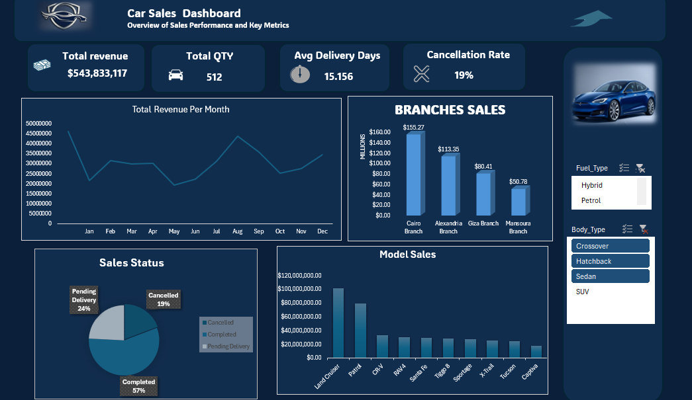

# 🚗 Car Sales Dashboard

## 📊 Overview

This project presents an interactive dashboard designed to analyze car sales performance and provide key business insights.
The dashboard enables tracking of revenue, sales volume, delivery efficiency, and cancellation trends.

---

## ❗ Problem

Sales data was inconsistent and unstructured, making it difficult to track performance and identify key drivers of revenue and operational efficiency.

---

## 🧹 Data Cleaning

The `FACT_Sales` dataset was cleaned and standardized before analysis:

* Converted IDs to integer format
* Standardized dates to **YYYY-MM-DD**
* Removed currency symbols from price columns
* Removed % signs from discount and commission columns
* Unified status values into:

  * Completed
  * Pending Delivery
  * Cancelled
* Removed duplicate records and empty rows

---

## 📈 Dashboard Features

* KPI Cards:

  * Total Revenue
  * Total Sales (Qty)
  * Avg Delivery Days
  * Cancellation Rate
* Monthly Revenue Trend
* Branch Sales Analysis
* Model Performance Analysis
* Sales Status Distribution
* Interactive Filters (Body Type & Fuel Type)

---

## 🛠 Tools Used

* Microsoft Excel
* Power Query
* Pivot Tables & Pivot Charts

---

## 📸 Dashboard Preview

---

## 🚀 Key Insights

* Cairo branch generated the highest revenue
* Peak sales occurred mid-year
* Cancellation rate reached ~19%
* Certain models significantly outperform others

---

## 📌 Conclusion

This dashboard helps transform raw sales data into actionable insights, supporting better decision-making and performance tracking.

