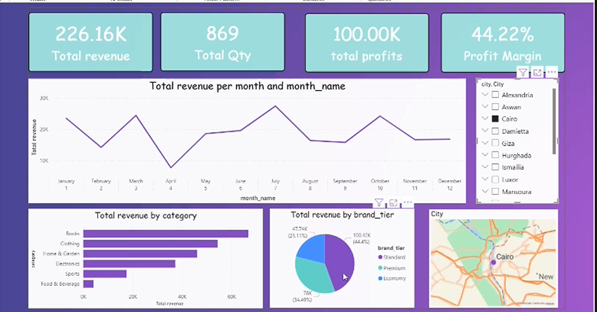

# sales-data-analysis
# 📊 Sales Data Analysis Dashboard

## 🧠 Problem

Sales data across regions and product categories was inconsistent, making it difficult to track performance and identify key revenue drivers.

---

## 🛠️ Tools

* Microsoft Excel
* Power Query
* Pivot Tables
* Data Visualization

---

## ⚙️ Analysis & Process

* Cleaned and transformed raw data using Power Query
* Built a structured data model for analysis
* Created Pivot Tables to analyze revenue trends and product performance
* Designed an interactive dashboard for clear data visualization

---

## 🔍 Key Insights

* 📈 Revenue peaks mid-year, indicating seasonal demand trends
* 💎 Premium product categories generate the highest profit
* 📍 Cairo region contributes the largest share of total revenue
* 🔄 Sales performance varies across categories and regions

---

## 🚀 Impact

* ✅ Established a reliable and consistent reporting system
* 📊 Improved visibility of high-performing products and regions
* 🎯 Enabled better data-driven decision-making

---

## 🖼️ Dashboard


```md
## 🖼️ Dashboard



```

